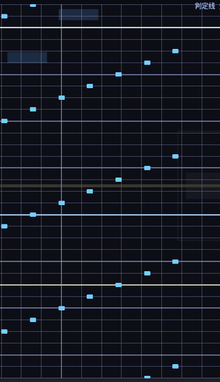

# OpenPhM

**Phigros 谱面编辑器** —— Rust + egui/eframe，**自研 wgpu 实例化渲染管线**，Linux 优先、Windows 可交叉编译。
原生格式 `opm` 与 RPE 编解码都是自己实现的（**不链接 prpr**）。


> 截图都用 `opm-app --shot`（egui 视口自截屏）拍，与合成器无关。
> 门面用的这几张是**精选产品图**；每轮开发攒下的取证截图（29 MB / 109 件）不入库 —— 见「图片与取证」一节。

## 这是什么

一个**面向长期写谱**的编辑器：判定线是父对象、音符是它的子对象，音符位置由**判定线的流速积分**决定 ——
与游戏内表现同一套算法。编辑器只认自己的文档模型，格式差异全部收敛在 `codec` 层，导入导出都出**保真度报告**
（做了什么转换、丢了什么），导入还会把事件轨道规范化成"无空隙无重叠"。

| 能力 | 状态 |
|---|---|
| 读写原生 `opm` | ✅ 单文件、`.opm` 容器（zip）、无压缩文件夹 |
| 导入 / 导出 RPE 谱面包 | ✅ `.pez` 包、RPE 文件夹、裸 RPE JSON（`info.yml` + `chart.json`） |
| 官谱（official）格式 | ❌ 未接（只有 opm ↔ RPE 两条路） |
| 平台 | Linux 主力；Windows 交叉编译出 `.exe` 并在 Wine 上验过 GUI/无头渲染/中文，**真 Windows 机器未验** |
| agent / 脚本驱动 | ✅ 控制通道 + 无头渲染 + 自截屏（见下） |

## 30 秒上手

```sh
cd app
cargo build --release

# 造一份 120 音符的演示谱面并打开（不内建任何谱面，--notes 是你要的）
./target/release/opm-ctl new --out /tmp/demo.opm --bpm 180 --demo-notes 120
./target/release/opm-app --doc /tmp/demo.opm

# 打开别人给的 RPE 谱面包
./target/release/opm-app --doc 某谱面.pez
```

依赖：`7z`（`.opm` / `.pez` 打包解包，缺了会被一道关不掉的门槛挡住并给下载页）、Vulkan 或 GL、PulseAudio/PipeWire。
系统里没有中文字体也不要紧 —— **CJK 字体内嵌**（思源黑体，OFL-1.1）。

**详细用法见 [使用教程](docs/%E4%BD%BF%E7%94%A8%E6%95%99%E7%A8%8B.md)**（界面总览、写谱全流程、事件与流速、
时间轴、播放与音频、快捷键总表、命令行与控制通道、故障排查）。

## 基本功能

- **演奏区预览**：判定线 + 音符按流速积分实时下落，与游戏内同一套算法；窗口边界、判定线长度、叠加层都可调。
- **判定线树**（左侧）：判定线 → 事件轨道 → 事件 → 子音符，四级；行尾直接显示该线**此刻**的表演值。
- **属性检查器**（右侧）：选中什么改什么（线 / 事件 / 音符），另有「此刻表演（事件求值）」实时读数。
- **时间轴**：拍线按缩放自适应抽稀、当前轨道的事件曲线（**保持空位里的值**）、子音符条、点拖定位。
- **事件编辑**：五条轨道（moveX/moveY/rotate/alpha/speed）分列显示，拖动创建事件块、拖控制杆改起止、两段式缓动选择。
- **音符编辑**：框选/多选、拖动、吸附格点、检查器改字段；四种音符（tap/hold/drag/flick）。
- **流速与音符位置**：改流速立刻见效 —— 加载时把每条线的音符位置算准（2 万音符 1.8 ms），
  之后的改动**异步补算**并把它之后的音符标脏，底栏显示 `⟳ 音符位置重算 N/M`。
- **撤销 / 重做**：所有改动走同一条命令路径（`EditCore::exec`），一条命令 = 一个撤销步；
  批量可 `begin`/`commit` 成一步。撤销栈按字节封顶（64 MiB）。
- **音频时钟**：播放头跟音频游标走（实测差 0.00 ms），输出延迟自校准；支持 wav/ogg/flac/mp3/m4a/aac/alac…
- **单会话 + 崩溃恢复**：同一时刻只允许一个进程改同一份谱面；被强杀/崩溃后下次启动会问「继续 / 丢弃」，
  未保存改动有守卫。
- **四种保存形态**：`opm` 包 / opm 文件夹 / RPE 包 `.pez` / RPE 文件夹 —— 存回哪种形态记在会话里，Ctrl+S 不会跑偏。

## 相对 RPE 编辑器的几处不同做法

> RPE 是 Unity 写的官方编辑器，它的内部实现我们无法在这里核实 —— 所以下面只说 **OpenPhM 怎么做**，
> 以及这么做带来的**可验证结果**（数字都标了出处，见 [`app/README.md`](app/README.md) 的实测表）。

### 1. 平滑滚动：音符位置是时间的**函数**，不是逐帧累加

音符离判定线多远 = `(H(t_音符) − H(此刻)) × 该音符的倍速`，其中 `H = 120∫v dτ`（流速对时间的积分，秒域）。
每帧用**音频时钟**算一次，而不是"上一帧位置 + 速度 × Δt"。于是：

- **与帧率解耦**：掉帧只是少画几帧，位置不会漂；暂停/seek/拖动播放头之后不需要"追上"。
- **改流速立刻正确**：流速事件的重叠/空位语义与"重新加载后的结果"**同一份实现**（`perf::active_event`），
  不会出现"运行时一个样、重载后另一个样"。
- **流速事件只按 linear 求值**：这样 `∫v dτ` 有闭式解（`(v₀+v₁)/2 × Δt`，精确、无抽样），
  整条链路（检查点表 / 异步重算 / 现算兜底）都因此更简单。导入的谱面若带非线性缓动的流速事件，
  **文档原样保留**，只是预览按线性算 —— 导入报告与检查器都会写明。



### 2. 性能与稳定性：把"每帧要花多少"量出来，再按数字改

一次实测（`tests/floor_bench.rs`，release，200 事件 + 递增音符数）：

| 音符数 | 加载时算好全部位置 | 查表 | 现算 | 每帧实例构建 p50 | 异步补算 |
|---|---|---|---|---|---|
| 2 000 | 0.23 ms | **4.1 ns** | 53 ns | 0.041 ms | 1 帧（0.10 ms） |
| 20 000 | 1.8 ms | 4.1 ns | 52 ns | 0.41 ms | 5 帧（0.77 ms） |
| 100 000 | 5.8 ms | 4.1 ns | 62 ns | 2.08 ms | 25 帧（2.40 ms） |

- 位置缓存让"每帧现算"从 158–224 ns/音符降到 **4 ns**（约 13–50 倍）；实例构建每帧重建也只有 **0.002 ms**（20 万音符同）。
- 整帧 p50 在 240 Hz 上打满（4.17 ms），其中 UI 0.14 ms、实例 0.002 ms；**p99 9–11 ms**（约 1% 的帧错过 vsync）。
- 广播是**细粒度**的：改一条线的属性只重建"它那条线的那一部分"，实测 6 条改动 **0 次整表重建**。
- 稳定性不是靠"小心"：唯一可写方是 `EditCore`，一条命令一个撤销步、失败只回滚自己；
  会话锁保证同一时刻只有一个进程改同一份谱面；崩溃后靠解压缓存里的会话元数据问「继续 / 丢弃」。

### 3. 可拖动的音符：拖动期间**文档每帧都在变**，预览不会骗人

按下左键那一刻把选区里每一条的位置**冻结**（`edit::Grab`），之后每帧按指针位移发命令 ——
所以拖动过程本身就是"文档的真实状态"，松开不需要"应用"，也不会出现"拖一下跑得比鼠标快"的累积漂移。
一次拖动 = 一个撤销步（`begin`/`commit`）。


- 框选（`Shift`+拖动）：**起始点落在哪个半区就只选那一类**（音符 xor 事件），Del 不用猜该删哪个。
- `Ctrl`+左键切换选中；吸附永远落在**画得出来的格点**上（纵向细分随缩放抽稀，与画出来的一致）。
- hold 有起点/终点控制杆；拖控制杆改一端，另一边不动且不许交叉。

### 4. 事件块与「值输入框」：打字不写文档，**回车/失焦才提交**

事件区按五条轨道分列，块只占列宽 55%（免得恒定事件看起来像列底色）；拖块体平移、拖上下边缘改起止。
右侧检查器里的数值用 `DragValue(update_while_editing = false)`：

- **鼠标拖动实时**改值（看得见效果），**键盘输入只在回车/失焦时提交一次**。
  判据是"值真的变了没有"，而不是 egui 的 `Response::changed()` —— 后者在编辑态下敲第一个字符就为真，
  会把一堆中间值灌进撤销栈（这坑踩过，注释留在代码里）。
- 缓动选择拆成「曲线 | in/out/io」两段（29 个名字翻起来太慢），拼出来的名字保证落在 `spec/easing.json` 的 29 个里。
- 重名/越界有明确行为：`laneX` 夹到 ±675 **再吸附**；拍值写成**整数有理数**（`1/4` 这类，不是浮点）；
  认不出的缓动名**原样保留**、不改写用户文件；流速轨不给缓动选择器（只按线性求值），原文件带非线性缓动会标注出来。
- 事件块的重叠是**合法**的：状态栏会说「⚠ N 处事件重叠」，冲突浏览器可逐个跳转，
  预览按"起点最晚的那条生效"算 —— 与重新加载后的结果一致。


### 5. 每一次改动都可撤销：命令是唯一写入口

GUI、命令行、控制通道**走同一条命令路径**（`EditCore::exec`）：界面不能直接改文档，
所以"界面看到的"与"命令行改出来的"必然一致，也必然可撤销。撤销日志记的是**可逆改动**
（不是整份文档快照），按字节封顶 64 MiB。

### 6. 能被脚本 / agent 驱动

```sh
# GUI 开一个控制通道（打印 socket 路径）
opm-app --doc chart.opm --control auto

# 从外面选中一条事件、定位到 12.5 秒、读界面统计
opm-ctl --attach auto --cmd '{"op":"select","line":0,"track":"speed","event":0}' \
                      --cmd '{"op":"seek","to":12.5}' --cmd '{"op":"ui_stats"}' --json

# 不开窗口直接出图（agent 改完谱自己"看"结果）
opm-ctl --file chart.opm render --at 12.5 --width 1280 --height 720 --out /tmp/a.png
```

无头 / 批量也走同一套命令：`opm-ctl --file x.opm --cmd '{…}' --cmd '{…}' --save`，退出码有约定
（有失败 1、校验有错 3、有事件重叠 4）。自动化钩子（`OPM_EDIT_AUTO` / `OPM_KEY_AUTO` / `OPM_LAUNCH_AUTO`）
让"没人点鼠标"也能把界面摆到某个状态 —— 上面那几张截图就是这么拍的。

## 使用教程

- **[使用教程](docs/%E4%BD%BF%E7%94%A8%E6%95%99%E7%A8%8B.md)** —— 从打开一份谱面到写出成品：
  界面总览 / 写音符 / 写事件 / 流速与位置 / 时间轴 / 播放与音频 / 保存与保真度 / **快捷键总表** /
  命令行与控制通道 / 故障排查。文字路径：`docs/使用教程.md`。

## 构建与运行

```sh
cd app
cargo build --release          # 产物：target/release/{opm-app,opm-ctl}
cargo test                     # 321 个测试
cargo build --target x86_64-pc-windows-gnu --release   # 交叉编译 Windows exe（需 mingw 工具链）
```

`opm-app --help` 列出全部选项（截图/基准/对齐自检/工作区预设等自动化开关）。

## 文档地图

| 文档 | 内容 |
|---|---|
| **[使用教程](docs/%E4%BD%BF%E7%94%A8%E6%95%99%E7%A8%8B.md)** | 面向使用者：怎么把谱写出来 |
| [`app/README.md`](app/README.md) | 面向开发者/维护者：设计取舍、**实测数字**、已知问题（很长，当手册查） |
| [`app/AGENT-API.md`](app/AGENT-API.md) | agent 视角：命令层、控制通道、无头渲染、退出码 |
| [`spec/opm-format.md`](spec/opm-format.md) + `spec/*.json` | opm 格式定义；枚举表（音符类型/缓动）是**唯一数据源**，代码里不许再抄一份 |
| [`OpenPhM-格式设计提案.md`](OpenPhM-格式设计提案.md) | 为什么这么设计数据结构 |
| [`OpenPhM-框架选型.md`](OpenPhM-框架选型.md) | 框架选型与逐轮实测记录（含 spike 结论） |

## 图片与取证

- **入库的只有门面图**：`docs/images/`（4 张 + 1 段动画，约 2.4 MB），是刻意挑选的产品图，换机器也看得懂。
- **不入库的是取证图**：每轮开发用 `--shot` 拍的截图、本机录音、一次性样本 —— 它们记录的是"在这台机器上
  画成了什么样"（字体/显卡/DPI 都参与），且会无限增长（曾经 29 MB / 109 件）。现归档在
  `~/.dsh/workspace/OpenPhM-artifacts/`，`.gitignore` 里有 `/artifacts/` 规则挡住。
  文档里写 `本机证据/xxx.png` 时，指的就是那份归档。

## 状态与已知限制

- **官谱格式未接**；RPE 的**流速事件缓动**不参与求值（只线性，文档原样保留）。
- **没有复制/粘贴**、没有 `Ctrl+Y`（重做是 `Ctrl+Shift+Z`）、没有 `Ctrl+A`、没有方向键微调、
  没有右键菜单 —— 故意不做，不是漏了（快捷键总表里列了"没有的东西"）。
- `Ctrl+S`/`Ctrl+O` 目前**不受模态门控**（文件对话框开着时也能触发），与空格/`Ctrl+Z` 的纪律不一致。
- `--fps-cap` 不可靠（实测 cap=30 → 59 fps），保留仅作对照；帧率上限交给 vsync。
- 切换音频在 UI 线程上做（换一次约 0.9 s，期间界面会卡一下）。
- **Windows 只在 Wine 上验过**，没有真机测试。

## 许可证

**GNU General Public License v3.0 或更高版本**（GPL-3.0-or-later）。全文见 [`LICENSE`](LICENSE)
（GPL-3.0 标准文本，674 行 / 35147 字节，未作任何修改）；`app/Cargo.toml` 的 `license` 字段同此声明。

```text
Copyright (C) 2026 OpenPhM 作者（仓库：https://github.com/DemonPlayer00/OpenPhM）

本程序是自由软件：你可以按自由软件基金会发布的 GNU 通用公共许可证条款重新发布和/或修改它，
条款为第 3 版或（按你的选择）任何更高版本。

本程序分发的目的是希望它有用，但**没有任何担保**，甚至没有适销性或特定用途适用性的默示担保。
详见 GNU 通用公共许可证。

你应该已经随本程序收到了 GNU 通用公共许可证的副本（见 `LICENSE`）；如果没有，
见 <https://www.gnu.org/licenses/>。
```

**"or later" 是什么意思**：你可以按 GPL-3.0 的条款使用本项目，**也可以**按任何更新的 GPL 版本使用它
（这是本项目在 `Cargo.toml` 里选的档位）。想按 GPL-3.0 **only** 使用、或想把本项目**并入**不兼容
GPL 的工程，都需要另外的授权 —— 那要联系作者。

**为什么是 GPL**：这个档位是**框架选型时定下的硬约束**，整套依赖按"与 GPL-3.0-or-later 兼容、且允许
静态链接"逐项复核过（`wgpu` / `egui` / `eframe` / `egui-wgpu` 为 MIT OR Apache-2.0，`winit` 是**单一**
Apache-2.0）。被否掉的方案里就有这类结构性冲突：音频硬依赖专有 BASS（禁止再许可）、JUCE 的 AGPLv3
（与 GPL-3.0 不兼容）、slint 的 `GPL-3.0-only`（未授予 or-later）。逐项复核见
[`OpenPhM-框架选型.md`](OpenPhM-框架选型.md) §3（候选矩阵）与 §11（修正记录）。RPE 的编解码是**自己写的**
（不链接生态里的参考实现），所以"格式互通"不会带来许可上的连带。
