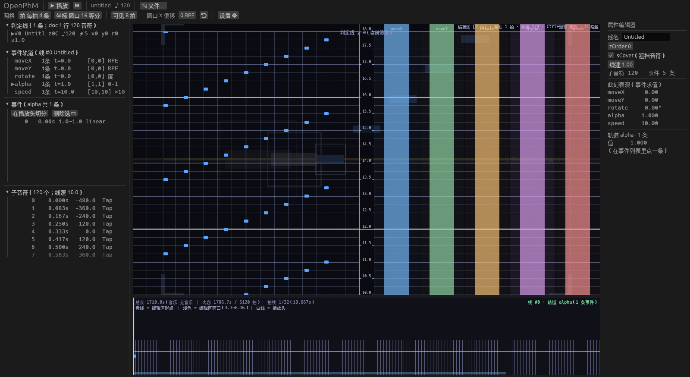
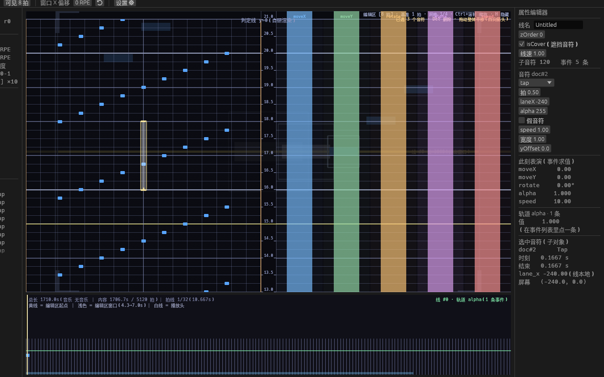
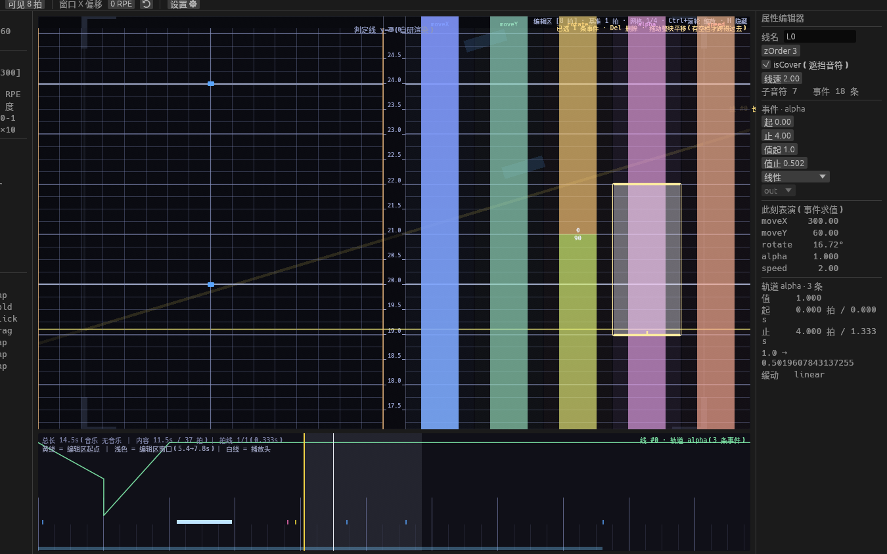
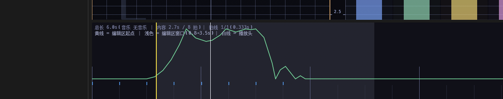
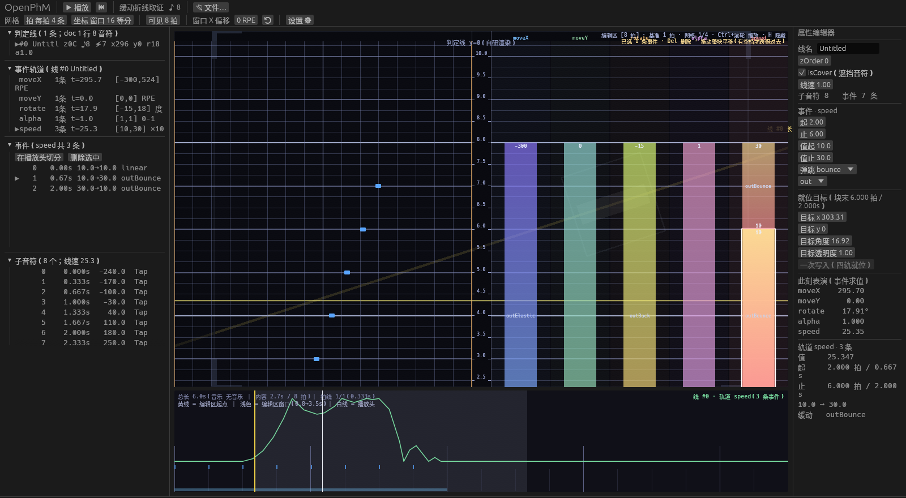
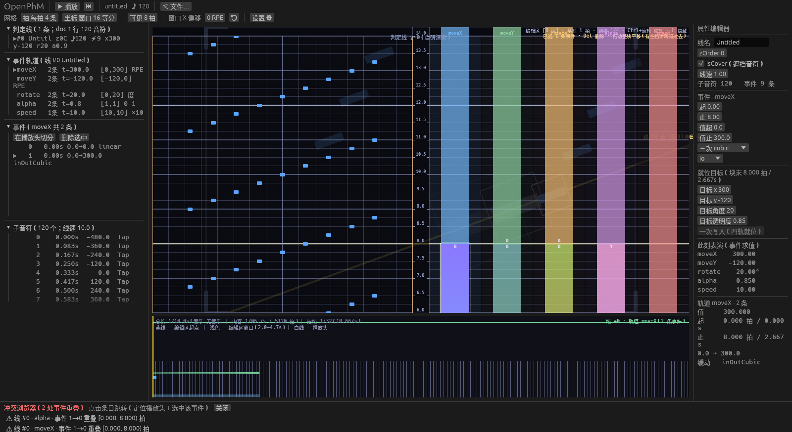
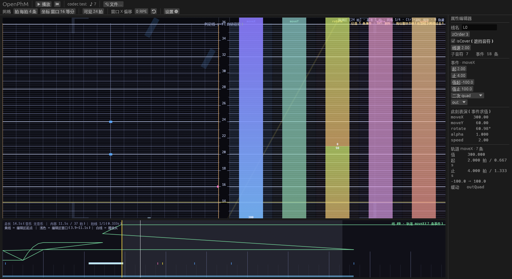

# OpenPhM 使用教程

> 面向**写谱的人**：从打开一份谱面开始，到写出一份能交付的成品。
> 想改代码看 [`../app/README.md`](../app/README.md)；想用脚本/agent 驱动看 [`../app/AGENT-API.md`](../app/AGENT-API.md)。
> 回到门面：[`../README.md`](../README.md)。

**目录**

1. [装好、启动](#1-装好启动)
2. [界面总览](#2-界面总览)
3. [新建与打开](#3-新建与打开)
4. [写音符](#4-写音符)
5. [写事件](#5-写事件)
6. [流速与音符位置](#6-流速与音符位置)
7. [时间轴](#7-时间轴)
8. [播放与音频](#8-播放与音频)
9. [保存、形态与保真度](#9-保存形态与保真度)
10. [快捷键与鼠标总表](#10-快捷键与鼠标总表)
11. [命令行](#11-命令行)
12. [控制通道（让脚本改界面里的谱面）](#12-控制通道让脚本改界面里的谱面)
13. [无头渲染与自截屏](#13-无头渲染与自截屏)
14. [故障排查](#14-故障排查)
15. [自动化环境变量](#15-自动化环境变量)

---

## 1. 装好、启动

```sh
cd app
cargo build --release
./target/release/opm-app            # 打开起始界面（最近打开的谱面 + 新建）
./target/release/opm-app --doc 谱面.opm   # 直接打开一份
```

**依赖**（缺了会有明确提示，不会静默退化）：

| 依赖 | 干什么用 | 缺了会怎样 |
|---|---|---|
| `7z` | `.opm` / `.pez` 的打包解包 | 一道**关不掉的门槛**模态会拦住，并给下载页；opm 文件夹形态仍可用 |
| Vulkan 或 OpenGL | 演奏区渲染 | 自动回退；`--fonts` / `--audio-probe` 这类自检不需要显卡 |
| 音频设备（PulseAudio/PipeWire/ALSA） | 播放与对拍 | 无音频也能编辑，播放头按帧时钟走 |

**几个立刻用得上的开关**：

```sh
opm-app --notes 200            # 造 200 个音符的演示谱面（默认 0：不内建任何谱面）
opm-app --ws timeline          # 工作区预设：compose(默认)/timeline/perform/debug
opm-app --width 1920 --height 1080
opm-app --audio off            # 明确不要音频
opm-app --help                 # 全部选项
```

---

## 2. 界面总览



| 区域 | 是什么 | 要点 |
|---|---|---|
| **顶栏** | 播放/暂停、回到开头、📂 文件…、设置 ⚙，以及几个直接改的数值 | 「可见 N 拍」「网格 每拍 N 条」「窗口 X 偏移」「判定线半长」「编辑区暗度」都是**视图状态**：不进文档、不进撤销栈 |
| **左侧 · 判定线树** | 判定线 → 事件轨道 → 事件 → 子音符（四级） | 行尾直接显示该线**此刻**的表演值（x/y/旋转/透明度），"事件到底生效了没有"先看数字 |
| **中央 · 演奏区** | 判定线 + 音符的实时预览 | 与游戏内同一套算法（见 §6）。左边是音符区，右边 5 列是事件区，中间一条 34 px 轴带 |
| **右侧 · 属性检查器** | 选中什么改什么：线 / 事件 / 音符 | 还有「此刻表演（事件求值）」实时读数；选中音符时另有一段「选中音符（子对象）」显示屏幕坐标 |
| **底部 · 时间轴** | 拍线、事件曲线、子音符条、播放头 | 点/拖定位；曲线**保持空位里的值**（不会掉回默认值） |
| **底栏 · 状态栏** | 播放头/拍、可见实例、帧号、广播计数、文档状态、**右端帧率** | 「⚠ N 处事件重叠」可点开冲突浏览器；`⟳ 音符位置重算 N/M` 表示后台正在补算位置；右端 `60.0 fps` 是**最近这一段（不少于 0.5 秒）实际出帧**的平均 —— 它只统计已经发生的帧、从不主动要求重绘，所以空闲时显示的就是心跳的真实帧率（默认 1 fps） |

工作区预设只是**面板显隐**的不同组合：`compose`（默认，全都要）、`timeline`（时间轴为主）、
`perform`（只要演奏区）、`debug`（多一个诊断面板）。

---

## 3. 新建与打开

### 打开

起始界面列出最近打开的谱面；`📂 文件…` 里可以打开文件或**文件夹**。**格式按内容判，不看扩展名**：

| 你手上的东西 | 长什么样 | 能不能开 |
|---|---|---|
| opm 包 | 一个 `.opm`（其实是 zip，里面有 `opm.json` + 音乐/曲绘） | ✅ |
| opm 无压缩文件夹 | 一个目录，里面 `opm.json` + 资源（**平铺，不递归**） | ✅ |
| RPE 谱面包 | 一个 `.pez`（zip，里面有 `info.yml` + `chart.json` + 资源） | ✅ |
| RPE 文件夹 | 一个目录，里面 `info.yml` + `chart.json` | ✅ |
| 裸 JSON | `opm.json`（本程序的单文件形态）或 RPE 的 `chart.json` | ✅ |
| 官谱（official）格式 | — | ❌ 未接 |

打开后左侧**控制台日志**会记一条「导入降级：…」或「导入无降级」；有降级就逐条列出来 ——
**"能打开"不等于"没丢东西"**，这句话在这个生态里值得当真。

### 新建

`📂 文件…` → 「🆕 新建…」：曲名（必填）、谱面作者、音乐作者、音乐路径、基础 BPM。
校验不过会留在弹窗里说明原因（不会把你填的一起收走）。新建会预置五条轨道常量
（moveX/moveY/rotate=0、alpha=1、speed=10 = 基准流速）。

> 顺手记一条**没有的东西**：`Ctrl+N` 不存在，"新建"只能在文件对话框里点。

---

## 4. 写音符

### 放一个音符

| 做法 | 结果 |
|---|---|
| `Q` / `W` / `E` / `R`（指针在音符区） | 放 tap / flick / drag / hold，位置**已吸附** |
| 左键**双击空白**（音符区） | 放一个 tap |
| `R` 之后 | 进入 **hold 草稿**：长度跟着鼠标，`R` / 回车 / 左键单击放下，`Esc` 取消 |

`Q/W/E/R` 的顺序就是种类列表的顺序（从左到右：tap、flick、drag、hold）。



### 选中与多选

| 做法 | 结果 |
|---|---|
| 左键单击音符 | 选它一个（命中判据是**切比雪夫距离** `< 10 px`，不是矩形） |
| `Ctrl`+左键 | 在"选中/未选中"之间切换 —— 可攒出一个多选 |
| `Shift`+拖动 | **框选**：起始点落在哪个半区就只选哪一类（音符 xor 事件），矩形相交即命中 |
| 左键点空白 / 轴带 | 清空选区 |
| `Shift`+左键单击 | **什么都不做**（刻意：没拖起来的 Shift+点击不该顺手清空选区） |
| 点左侧树里的音符行 | 选它（虚拟滚动列表，几万条也不卡） |

选中的音符会被"锚"记住（最后碰过的那一个）：**检查器、时间轴、树都只认锚**，所以多选不会把界面搞乱。

### 拖动

按住选中的音符拖走即可。三件事值得知道：

1. **一次拖动 = 一个撤销步**（`Ctrl+Z` 一次全回来），不会留下一串中间状态。
2. 按下那一刻选区里每一条的位置被**冻结**（`edit::Grab`），之后按指针位移算 —— 所以不会"拖一下跑得比鼠标快"。
3. 按下点在选区内 ⇒ 拖**整个选区**（相对偏移不变）；在选区外 ⇒ 先把选区换成它一个再拖。

### 用检查器改字段

右侧「属性编辑器」里，**数值字段是"回车/失焦才提交"**：

- **鼠标拖动实时改**（边拖边看演奏区反应）；
- **键盘输入敲字期间不写文档**，按回车或点到别处才提交**一次**。
  所以一个数字不会被拆成"1、12、123"三次改动灌进撤销栈。

| 字段 | 行为 |
|---|---|
| 音符：`拍`、`止`（仅 hold）、`laneX`、`alpha`、`speed`、`宽度`、`yOffset` | 数值；`laneX` 夹到 ±675 **再吸附**；拍值写成**整数有理数**（`1/4` 这类，不是浮点） |
| 音符类型下拉、`假音符`/`isCover` 勾选框 | **即时生效**（不需要回车） |
| 认不出的缓动名 | **原样保留**，不改写你的文件 |

### 删除

`Del` 删掉**整个选区**（音符或事件），一个撤销步。`Backspace` **故意没绑定**（不拿它删谱面内容）。

> **没有**复制/粘贴/剪切（`Ctrl+C/V/X` 无绑定）、**没有** `Ctrl+A`、**没有**方向键微调。
> 大改动的正确姿势是：改命令 JSON 走控制台或 `opm-ctl`（见 §11 / §12）。

---

## 5. 写事件

事件区在演奏区右侧，**五条轨道各占一列**：`moveX`（移动 X）、`moveY`、`rotate`（旋转）、
`alpha`（透明度）、`speed`（流速）。列底色是轨道色，列里的小块就是事件，上下位置 = 值，高度 = 时长。



### 建一个事件块

| 做法 | 结果 |
|---|---|
| 把指针放到某列上按 `R` | 起一个事件块草稿（落在**指针所在列**那条轨道上） |
| 拖动草稿里**别的地方** | 长度跟着鼠标（只改长度，不改起止比例） |
| 拖草稿的**上/下边缘**（细带 6 px） | 改起点或终点（另一边不动，且不许交叉） |
| `R` / 回车 / 左键单击（未拖动） | 放下 = 一条 `add_event` 命令 |
| `Esc` | 取消草稿 |

> 音符区用 `Q/W/E/R`，**事件区只认 `R`** —— `Q/W/E` 在事件区**什么都不做**（这是刻意的：
> 免得在事件区误触起一个草稿）。在标尺/轴带/区外按键会提示「音符区用 Q/W/E/R，事件区只有 R」。

### 选中、拖动、改时间

| 做法 | 结果 |
|---|---|
| 左键单击块 | 选它（同时把当前轨道切到它那列） |
| `Ctrl`+左键 | 切换选中 |
| 拖块体 | 只沿时间轴平移（按拍网格吸附）；**重叠的事件拒绝拖动**并给提示 —— 想修重叠就拖它的头/尾 |
| 拖块的上/下边缘 | 只改这一条的 `start` 或 `end` |
| 选了多个再拖 | 整组平移 |
| 头尾相接（两个事件共用一条边） | 优先抓"这一列上**被选中的**那个"；都没选中则抓**尾巴**（"止于这一点"） |
| 左侧树的「在播放头切分」 | 播放头严格落在块内部时可用：把事件在那一刻切成两条，**切点上的值 = 预览在那一刻显示的值**（带缓动，流速按线性） |
| 左侧树的「删除选中」 | 删掉当前轨道选中的事件 |

### 缓动：两段式选择

缓动拆成「曲线 | in/out/io」两段（29 个名字翻起来太慢），拼出来的名字一定落在 `spec/easing.json` 那 29 个里。
**五条轨道（含流速）都能选缓动** —— 包括变速事件，见下面这一节。

### 缓动是怎么"发生"的：每 0.1 秒一段的折线

理解这条能省掉很多"为什么和我想的不一样"：

- 编辑器**不**在求值时套一个曲线函数，而是把这条缓动**折成一条折线**：从块开头起**每 0.1 秒**一个节点，
  节点之间走直线。
- **首尾节点的值就是你在事件块上写的起值 / 终值**，所以"块末就位"永远按位精确（见上一节）。
- **回弹类缓动（`back` / `elastic` / `bounce`）的回弹点与折点会被单独采到** ——
  否则 0.1 秒的采样会把它们的过冲峰削平（实测 `outBounce` 会被削掉约 8%）。
  所以这几族的时间轴曲线会多出几个折角，那是**故意的**。
- **整块不足 0.1 秒**（快 BPM 下的短块）⇒ 等价于线性缓动：块太短，曲线没有意义。
- 邻近的采样点太密（不足 0.04 秒）会**合并**：末段并进前一段，回弹点彼此太近则先到先得。

实际效果：**变速事件也有曲线**（以前只有线性）。音符位置是流速的积分，而折线的每一段都是直线 ⇒
这个积分是**精确的闭式解**：没有抽样误差，也不会沿着一串段累加。

唯一的"近似"是节点**之间**那几段直线与理论曲线的差：普通缓动不到值域的 0.7%，
`circ` 族（弧线）最大约 8%。想要更细就把 `EASE_SEG_SEC`（源码里的 0.1）调小。



上图是**流速轨**的曲线（绿色）：从左到右是 `10 → 30`（`outBounce`）再 `30 → 10`（`outBounce`）。
那些**折角**不是画得糙 —— 它们是 `bounce` 的回弹点，必须原样出现在折线上，
否则 0.1 秒的采样会把每个峰削平（实测会差 8%）。



检查器里流速事件也能选缓动了（右栏「事件 · speed」下面那两段下拉框），
左侧事件块上印着缓动名（`outBounce`），底部时间轴画的就是它。

### 块末就位：一次把线放到目标坐标（0 误差）

选中一个事件块之后，检查器里会出现一组「**就位目标（块末 … 拍 / …s）**」：

| 字段 | 含义 |
|---|---|
| 目标 x / 目标 y | RPE 单位（窗口是 x∈±675、y∈±450） |
| 目标角度 | 度 |
| 目标透明度 | 0–1 |

四个数**一次给**，按「**一次写入（四轨就位）**」把这条线在**该块末尾**那一刻的状态写成你要的值。
它改的是**四条轨道**（moveX / moveY / rotate / alpha），整条命令是**一个撤销步**。
初值预填的是"块末那一刻现在是什么"，所以**只改你想改的那个数**，其余三个不用动。



上图：块末 8.000 拍处一次写入 x=300 / y=-120 / 角度 20° / 透明度 0.85 ——
「此刻表演」读到的正是 **300.00 / -120.00 / 20.00° / 0.850**（alpha 也不是 0.8499…），
演奏区里判定线确实转过去、挪到了那儿。四个数都还等于当前值时按钮是灰的（没有要写的）。

**为什么叫"0 误差就位"**：求值器在事件的端点是**按定义取端值**（不是插值算出来的），
所以你在这里写 `250.3`，那一刻求值到的就**按位**是 `250.3` —— 不是"误差小于 1e-9"。
（`back`/`elastic` 的过冲只发生在块**中间**，端点不受影响。）

四条轨道各按"那一刻是什么情形"动手，规则固定、可预期：

| 情形 | 动作 |
|---|---|
| 那一刻正好是某块的**终点** | 写它的终值（块内曲线跟着新终值走 —— 斜坡的中间点本来由两端决定） |
| 那一刻正好是某块的**起点** | 写它的起值 |
| 那一刻落在某块**内部** | **先在此切一刀**（切点值 = 当前值，不跳变），再写两侧端值。注意：块内形状会因切分而重排 |
| 那一刻在**空位**（前一块已结束） | 写**前一块的终值** —— 空位的值就是它（不是全局默认） |
| 那一刻在**首块之前** | 写首块的**起始值** |
| 这条轨道**一条事件都没有** | 它被跳过，并在返回里说明（先用「铺满全谱」或放一块） |
| 那一刻的值**已经**等于目标 | 跳过 —— 于是"只改 X"不会顺手切开别人的块 |

> **重叠时会改"此刻真正生效的那一块"**：判据与求值器是同一条（起点不晚于该拍的最后一条）。
> 这一点踩过坑 —— 早先按"哪个块结束在这一拍"去找，遇到"一条斜坡 + 一条后加的常量覆盖同一段时间"时，
> 命令会去改那条**不被求值**的斜坡：命令报成功、画面上那一刻的值纹丝不动。

流速轨**不在其中**：它不是"坐标"，音符位置是它的积分（见 §6）。

### 重叠与规范化

- **重叠是合法的**：底栏会显示「⚠ N 处事件重叠」，点它打开**冲突浏览器**，可以逐个跳转（跳过去会同时选中那条线与那条事件）。
- 预览按「**起点最晚的那条生效**」算 —— 与"重新保存再打开"的结果一致（这一条曾经不一致：运行时一个样、重载后另一个样）。
- `{"op":"normalize"}`（控制台/`opm-ctl`）把整条轨道规范成**无空隙无重叠**：排序 → 丢零长度 →
  重叠处把**前一条的 end** 挪到后一条的起点（**后一条的起点不动**）→ 首事件补到拍 0 → 末事件延拓到谱尾（斜坡是"另加一条常量段"，不被拉长）。
  导入 RPE 时走的就是这套规则。

---

## 6. 流速与音符位置

**音符离判定线多远 = `(H(t_音符) − H(此刻)) × 该音符的倍速`**，其中 `H = 120∫v dτ`
（流速对时间的积分，秒域；1 个流速单位 = 120 RPE y 单位/秒，默认流速 10 = 1× = 1200 单位/秒，
即 0.75 秒穿过整个 900 高的窗口）。

这意味着三件事：

1. **位置是时间的函数，不是逐帧累加** —— 掉帧只是少画几帧，位置不会漂；seek / 拖播放头之后不需要"追上"。
2. **改流速立刻正确**：编辑器不会"等到重新加载才生效"。
3. **低于判定线的音符不画**（`y_local < 0`）：线下的音符按规则不显示，但**命中特效照常从命中那一刻播**。

### 加载时算好 + 改动后异步补

- **加载时**就把每条线所有音符的位置算准（实测 2 千/2 万/10 万音符分别 **0.23 / 1.8 / 5.8 ms**）。
- 之后改流速事件，只会影响**它之后**的音符 ⇒ 编辑器把它们标脏，然后在每帧预算内**异步补算**（每帧 4096 条，实测 0.2~0.8 ms/帧）。
- 补算期间底栏显示 **`⟳ 音符位置重算 已完成/总数`**，顺序是「当前播放头 → 结尾」，然后「开头 → 当前播放头」。
  期间界面照常可用 —— 没算准的音符**现算兜底**（每颗约 50–60 ns），所以不会闪、也不会显示错位置。

> 细节：`H` 用**检查点表**加速（每段流速事件 + BPM 折点一个检查点），查表 4 ns/音符；
> 流速事件只按 **linear** 求值，于是积分有闭式解（`(v₀+v₁)/2 × Δt`，精确、无抽样）——
> 这是"为什么改流速能立刻见效且不糊"的技术底子。

---

## 7. 时间轴



- **点/拖任何位置 = 定位**（不吸附格线；连读数文字区域也算）。时间轴本身**没有**滚轮缩放、没有键盘操作。
- **曲线**画的是当前选中轨道的取值：每个事件按它的缓动采样，**空位保持相邻那块的值**，两端补到画面边缘。
- 曲线下方是**子音符条**：**4 行，自上而下分别是 Tap / Hold / Drag / Flick**（颜色与演奏区同一套；
  哪一行是哪种音符，读数第 2 行末尾写着）。**同一行里时间上重合、或间隙不足 1px 的音符合并成 1 个矩形** ——
  整谱可见时 5 万音符会压成每行一段：既看得出"这一段是谁在堆"，也不再一颗一个矩形地画
  （那是每帧 5 万个形状、实测约 40 fps；合并后同一份谱面 120 fps）。选中的音符画白色、压在种类色之上，
  所以合并**不会**把选中的那颗吃掉。
- 缩放：`Ctrl`+滚轮（或触控板捏合），可见拍数夹在 **4…256 拍**之间；顶栏「可见 N 拍」也能直接输入。
- 平滚：无 `Ctrl` 的滚轮 = 改当前时间（向上滚 = 往后），步长随可见拍数自适应。

拍线密度会**自适应抽稀**：整谱可见时不会把几万条线全画出来（曾经 20 万音符的谱面画出 5 万条线，把帧时间拖到 20 ms）。
吸附永远落在**画得出来的格点**上 —— 纵向细分随缩放抽稀，与画出来的一致。

---

## 8. 播放与音频

### 空格：单点切播、长按试听

阈值 **0.28 秒**：

| 操作 | 行为 |
|---|---|
| **单点**（< 0.28 s） | 停着 → 开始播放，**松手继续播**（进入自动播放）；正在播 → **按下即暂停** |
| **长按**（≥ 0.28 s） | 按下开始播，**松手就暂停**（适合"按住试听一下"）；若按下时本来就在播，松手不再动作 |
| 按住不放（自动重复） | 重复的按键事件被忽略，不会把"长按"误判成"单点" |

### 音频时钟

播放头跟**音频游标**走，不是帧时钟：实测播放头与音频游标差 **0.00 ms**，输出延迟**自校准**（本机 24.00 ms），
速率偏差有界（±7 ms 内）不累积，20 秒回调欠载 **0**。

- 音频来源：`--audio FILE` > 谱面 `meta.audio` > `--audio off`（明确不要）。
- 换音频（改 `meta.audio` 或重新打开谱面）在 UI 线程上做，**换一次约 0.9 s，界面会卡一下**（已知问题）。
- 想校准设备延迟：顶栏/控制通道可改 `offsetMs`，改完听拍子对齐即可。

### 自动播放：音符到线、闪一下、消失

播放时音符落到判定线会**闪一下**并消失；hold 每 3 拍再闪一次。这是刻意做的"游戏内表现"预览。

---

## 9. 保存、形态与保真度

### 四种形态

| 形态 | 产物 | 什么时候用 |
|---|---|---|
| **opm 包**（`.opm`） | 一个 zip：`opm.json` + 音乐 + 曲绘 | 交付/备份，单文件最省事（推荐） |
| **opm 无压缩文件夹** | 一个目录，平铺 `opm.json` + 资源 | 想用 git / diff 跟踪谱面内容时 |
| **RPE 包**（`.pez`） | 一个 zip：`info.yml` + `chart.json` + 资源 | 交给 Phira / RPE 生态 |
| **RPE 无压缩文件夹** | 一个目录，`info.yml` + `chart.json` + 资源 | 同上，但要能直接看文件 |

`Ctrl+S` 存回**上次那个形态与路径**（形态记在会话里）；`Ctrl+Shift+S` 另存为。

> **单文件 JSON（`.opm.json`）只能"写回已存在的文件"**：新建/另存为到一个 `.opm.json` 会被明确拒绝
> （提示你选一种形态），不会再悄悄产出裸 JSON。

### 资源名会规范化

保存时，`meta.audio` / `meta.background` 里的外部路径会被改成**包内文件名**，文档字段同步改写 ——
这一步**走命令路径**（可撤销、会广播），所以你不会遇到"文件改了、界面不知道"。

### 保真度报告

每次导入/导出都给一份报告：**做了什么转换**（`conversions`）与**丢了什么**（`warnings`）；
两者都空才算 `lossless`。CLI 侧 `opm-ctl convert` 在有降级时**退出码 1**，方便脚本判断。

导入时的事件轨道**一定会被规范化**（补空隙、裁重叠、首事件从拍 0 起、末事件延拓到谱尾）——
报告里会写明补了几处。这保证了"编辑器里的轨道无空隙无重叠"这条不变量。

---

## 10. 快捷键与鼠标总表

### 三条"按键为什么不灵"的前提

1. **任何控件拿到键盘焦点，全部快捷键让路**（判据是 egui 的 `wants_keyboard_input()`，不是"是否在文本框里"）。
   刚点过一下的数值框也算 —— 点别处或按 `Esc` 交还焦点即可。
2. **模态开着时**（文件对话框 / 未保存守卫 / 新建表单 / 缺 7z 门槛）空格、`Ctrl+Z`、`Del`、`H`、`Q/W/E/R` 都不生效。
3. **快捷键只在编辑页生效**；起始界面只认 `Esc`（= 跳过列表，直接进空谱面）。

### 快捷键

| 按键 | 作用 | 前提 |
|---|---|---|
| `Space` 单点（< 0.28 s） | 停着 → 播；播着 → 按下即暂停 | 编辑页、无模态、焦点不在控件上 |
| `Space` 长按（≥ 0.28 s） | 按下播、**松手暂停**（试听） | 同上 |
| `Ctrl+Z` | 撤销 | 同上 |
| `Ctrl+Shift+Z` | 重做（**没有** `Ctrl+Y`） | 同上 |
| `Ctrl+S` | 保存（走上次的形态/路径） | 只判"焦点不在控件上"（**模态开着也能触发**） |
| `Ctrl+Shift+S` | 另存为（系统文件对话框） | 同上 |
| `Ctrl+O` | 打开（系统文件对话框） | 同上 |
| `Del` | 删除**整个选区**（一个撤销步） | 编辑页、无模态 |
| `Backspace` | **无绑定** | — |
| `H`（按住） | 隐藏编辑区叠加层，松开恢复 | 编辑页、无模态 |
| `Esc` | 有草稿 → 取消草稿；有模态 → 关掉最上层可关闭的模态 | — |
| `Enter` / `R` / 左键单击 | 放下草稿（hold 或事件块） | 草稿中 |
| `Q` / `W` / `E` / `R` | 音符区：放 tap / flick / drag / hold | 指针在音符区、无草稿 |
| `R` | 事件区：起事件块草稿（列 = 轨道） | 指针在事件列、无草稿 |
| `Ctrl`+滚轮 / 捏合 | 缩放时间轴（可见 4…256 拍） | 指针悬停在演奏区上 |
| 滚轮 | 改当前时间（向上滚 = 往后） | 同上 |
| `Tab` / `Shift+Tab` / 方向键 | **应用无绑定**；egui 默认移动键盘焦点（文本框借此提交） | — |

**刻意没有的**（别找）：复制/粘贴/剪切、`Ctrl+A`、`Ctrl+Y`、`Ctrl+N`、方向键微调、
数字键缩放、右键菜单、中键平移画布、`Ctrl+Q` 退出、"回到开头"快捷键、时间轴的滚轮缩放。
清空选区请点空白或轴带（`Esc` **不清空选区**）。

### 鼠标

| 操作 | 结果 |
|---|---|
| 左键单击音符 / 事件块 | 选中（事件块：列由 x 决定，**列内 x 不再参与判定**，只看 y） |
| 左键单击标尺（演奏区顶部 18 px） | 定位播放头（**不清选区**） |
| 左键单击轴带（中间 34 px）或空白 | 清空选区 |
| 左键双击空白（音符区） | 放一个 tap |
| 左键拖动音符 / 事件块 | 平移（一次一个撤销步）；重叠事件拒绝拖动 |
| 左键拖动事件块上/下边缘（6 px） | 改起点 / 终点 |
| `Ctrl`+左键 | 切换选中 |
| `Shift`+拖动 | 框选（起始点半区决定选哪一类） |
| 左键点/拖时间轴 | 定位播放头 |
| 拖判定线本体 | **不存在** —— 判定线要靠事件轨道或检查器改 |

> 右键/中键**没有绑定**；单击只认主键，但**拖动不区分键**（按右键拖也会走进拖动分支）。

---

## 11. 命令行

### `opm-app`（GUI）

```sh
opm-app --doc FILE             # 直接打开（跳过起始界面）
opm-app --dialog file|new|guard # 启动就把某个对话框摊开（检查/截图用）
opm-app --audio FILE|off --autoplay
opm-app --width 1600 --height 900 --scale 1.25 --pos X,Y
opm-app --ws compose|timeline|perform|debug
opm-app --window-offset X --boundary on|off --line-len N --overlay on|off --overlay-beats N --overlay-alpha F
opm-app --beat-div N --lane-div N
opm-app --shot PATH --shot-frame 30 --shot-exit     # 自截屏
opm-app --control [PATH]                            # 开控制通道（不写路径=自动）
opm-app --idle-fps F --idle-seconds S --bench N --stress --verify-align
opm-app --notes N --audio-probe FILE --fonts --verbose-updates --trace-startup
```

几个默认值：窗口 1600×900、判定线全长 3000（RPE 单位）、可见 8 拍、叠加层与边界框默认开、空闲重绘 1 fps（0 = 纯事件驱动）。

### `opm-ctl`（无头 / 附着）

```sh
opm-ctl new --out 新谱.opm --name 曲名 --bpm 180 --demo-notes 120
opm-ctl convert IN [--to opm|opm-dir|rpe|rpe-dir] [--out PATH] [--rpe-version 160] [--quiet]
opm-ctl --file X.opm --cmd '{"op":"…"}' [--cmd '…'] [--save] [--json] [--atomic]
opm-ctl --file X.opm validate | lines [--at SEC] | overlaps | summary | dump | journal
opm-ctl --file X.opm render --at SEC --width W --height H --out PNG
opm-ctl --attach [SOCKET|auto] --cmd '{"op":"…"}'
```

**退出码**（脚本用得上）：`0` 成功；`1` 有失败的命令 / 转换有降级；`2` 用法或 IO 错误；
`3` 校验有 error（`validate` / `--attach` 的 errors）；`4` 有事件重叠（`overlaps`）。

**一个坑**：`--json` 必须写在**子命令之前** ——
`opm-ctl --file X.opm --json overlaps` ✅，`opm-ctl --file X.opm overlaps --json` ❌（会按人类可读输出）。
`--file … validate --json` 同理。

`convert` 两侧都打印保真度报告；`--quiet` 除了少说话，还会**不去设置 RPE 版本档位**（用默认 160），
所以"静音"与"输出内容"在这里不是完全正交的。

---

## 12. 控制通道（让脚本改界面里的谱面）

```sh
opm-app --doc chart.opm --control auto
# → 控制通道 已启用 → /run/user/1000/opm-4242.sock（opm-ctl --attach /run/user/1000/opm-4242.sock）

opm-ctl --attach auto --json \
  --cmd '{"op":"select","line":0,"track":"speed","event":0}' \
  --cmd '{"op":"seek","to":12.5}' \
  --cmd '{"op":"ui_stats"}'
```

- **只有拿到会话独占锁的实例才绑 socket** —— 第二个实例不会抢走已有会话的远程入口。
- `--attach auto` 会在 `$XDG_RUNTIME_DIR`（或 `/tmp`）里找最新的 `opm-*.sock`，并过滤掉死进程。
- 连上先收一条 `hello`（pid / 文档名 / 音符数 / revision），打在 **stderr**。
- **线格式**：Unix socket 上的**行分隔 JSON**，一问一答。命令返回 `{"ok":…,"op":…,"result":…,"revision":…}`。
- 只能**Unix**；Windows 上会如实返回"未实现"。

### 视图命令（改界面状态，不进文档）

```json
{"op":"play"} {"op":"pause"} {"op":"toggle_play"}
{"op":"seek","to":12.5}          // 秒；给 "beat" 则按拍
{"op":"nudge","beats":1}
{"op":"grid","beatDiv":4,"laneDiv":16}
{"op":"zoom","factor":0.5}       // 或 {"beats":8}
{"op":"window","offsetX":300}
{"op":"select","line":0,"track":"alpha","event":1}
{"op":"select","notes":[0,1,2]}  // 或 {"events":[[0,1],[0,2]]}
{"op":"audio","path":"/tmp/x.ogg"} {"op":"audio_offset","ms":24}
{"op":"view"}                    // = ui_stats
```

响应只承诺"**已受理**"（`result.view=true` + `queued`）——视图状态在**下一帧**生效，接着读 `ui_stats` 观察。

### 文档命令（走 `EditCore::exec`，可撤销）

音符：`add_note` / `set_note` / `del_note` / `move_notes`
判定线：`add_line` / `set_line` / `del_line`
事件：`add_event` / `set_event` / `del_event` / `resize_event` / `split_event` / `set_track_constant` / `normalize`
其它：`set_bpm` / `set_meta` / `load` / `save` / `render` / `undo` / `redo` / `begin` / `commit` / `abort`
查询（**不动文档、不进撤销栈**）：`summary` / `dump` / `validate` / `ping` / `overlaps` / `journal` / `patch` / `broadcasts`

例：

```sh
# 放一个 alpha 事件，再切一刀，再规范化（三条命令 = 三个撤销步；加 --atomic 则算一步）
opm-ctl --file x.opm --save \
  --cmd '{"op":"add_event","line":0,"track":"alpha","startBeat":[4,1],"endBeat":[12,1],"startValue":1.0,"endValue":0.0,"easing":"outQuad"}' \
  --cmd '{"op":"split_event","line":0,"track":"alpha","index":0,"atBeat":[8,1]}' \
  --cmd '{"op":"normalize"}'
```

**限制（重要）**：控制通道**没有**任何鼠标/点击/拖拽命令 —— Wayland 下没法往窗口里注入指针。
要点界面里那种"拖动中"的状态，用 §15 的环境变量（`OPM_EDIT_AUTO` / `OPM_KEY_AUTO`）。

---

## 13. 无头渲染与自截屏

```sh
# 无头出图：不开窗口、不需要音频设备
opm-ctl --file x.opm render --at 12.5 --width 1280 --height 720 --out /tmp/a.png

# 或者用核心命令（默认尺寸不同：1280×720）
opm-ctl --file x.opm --cmd '{"op":"render","out":"/tmp/b.png","at":12.5}'

# GUI 自截屏（egui 视口截图，与合成器无关；--shot-exit 截完退出）
opm-app --doc x.opm --shot /tmp/c.png --shot-frame 150 --shot-exit --idle-fps 60
```

三者对 agent 的意义：**改完谱自己"看"一眼**。`--shot-frame` 数的是帧，空闲 1 fps 时要等很久 ——
配 `--idle-fps 60`（帧太慢时用 `--idle-fps 120`）或者用 `--bench N` 强制跑帧。

---

## 14. 故障排查

| 症状 | 原因 / 怎么办 |
|---|---|
| 「会话锁已被占用 —— 本实例什么都不碰」 | 同一时刻只允许一个进程改同一份谱面。关掉那个实例再来；**别删锁文件**（锁随句柄走，被强杀由内核放掉） |
| 启动被「缺少 7-Zip」挡住 | 装 7z（门槛上按钮会开下载页）；或改用 opm 无压缩文件夹形态 |
| 上次被强杀/崩溃 | 下次启动会问「继续 / 丢弃」（依据解压缓存里的 `session.json`）。选继续 = 从缓存恢复，Ctrl+S 写回原文件 |
| 中文字显示成豆腐块 | 理论上不会（字体内嵌）。真遇到用 `opm-app --fonts` 自检 |
| 界面一卡一卡 / 帧率上不去 | 看诊断面板的帧时间；`--fps-cap` **不可靠**（实测 cap=30 → 59 fps），上限交给 vsync |
| 改 `meta.audio` 之后卡一下 | 换音频在 UI 线程做（约 0.9 s，已知问题） |
| 快捷键没反应 | 见 §10 的三条前提 —— 多半是某个控件还持有键盘焦点（点别处或按 `Esc`） |
| 事件"改了看不出效果" | 检查器显示的是**这一刻**的求值；确认播放头位置、以及该事件是否被后面那条重叠事件盖住（起点最晚者生效） |
| 音符位置在补算 | 底栏 `⟳ 音符位置重算 N/M`；期间照常可用（没算准的现算兜底） |
| 想清掉 `/tmp` 里的解压缓存 | 正常退出会自己清；崩溃残留会在下次启动时问你要不要继续（选丢弃即可） |
| GPU 选择 | Linux 默认**核显优先**（不唤醒独显）；要独显用 `prime-run` 或 `OPM_GPU=discrete`。启动日志有 `图形 ICD` / `显卡选用` 两行说明 |

---

## 15. 自动化环境变量

都**只在启动时读一次**，是给截图/CI/agent 用的，不影响交互路径：

| 变量 | 作用 |
|---|---|
| `OPM_EDIT_AUTO=hold:<lane>,<start>,<end>` | 摆出"正在跟随鼠标的 hold 草稿"（拍域） |
| `OPM_EDIT_AUTO=event:<track>,<start>,<end>` | 摆出事件块草稿；`track` ∈ `moveX/moveY/rotate/alpha/speed` |
| `OPM_KEY_AUTO=[帧号:]按键[,按键…]`（多组用 `;`） | 到那一帧注入按键，如 `30:Delete;60:ctrl+z`；修饰键写 `ctrl+`/`shift+`/`alt+` |
| `OPM_LAUNCH_AUTO=skip\|new\|create:<曲名>\|open:<path>\|recent:<n>` | 起始界面不用点鼠标就走完"选完进编辑页" |
| `OPM_RESUME_AUTO=continue\|discard\|later` | 崩溃恢复对话框的自动选择 |
| `OPM_CLOSE_AUTO=<帧号>` | 到那一帧请求关窗（走未保存守卫） |
| `OPM_TRACE_STARTUP=1` | 打印启动耗时分解（= `--trace-startup`） |
| `OPM_TL_TRACE=1` | 时间轴几何的调试输出 |

例：拍一张"事件草稿摆好、播放头在 6 秒、alpha 轨道第一条事件被选中"的界面：

```sh
OPM_EDIT_AUTO='event:alpha,19,22' \
TMPDIR=/tmp/opm-shot \
opm-app --doc x.opm --control /tmp/opm-shot/sock --shot /tmp/s.png \
        --shot-frame 300 --shot-exit --idle-fps 60 &
sleep 3 && opm-ctl --attach /tmp/opm-shot/sock --cmd '{"op":"seek","to":6.0}' \
                  --cmd '{"op":"select","line":0,"track":"alpha","event":0}'
```

---

## 附：这份教程里的"没有的东西"一并列出来

写文档最容易许下做不到的承诺，所以反向记一笔：**复制/粘贴**、`Ctrl+A`、`Ctrl+Y`、`Ctrl+N`、
方向键微调、数字键缩放、右键菜单、中键平移、时间轴滚轮缩放、拖判定线本体、`Esc` 清空选区、
"回到开头"快捷键、退出快捷键、官谱格式 —— **都没有**。
`Ctrl+S`/`Ctrl+O` 目前也不受模态门控（与空格/`Ctrl+Z` 的纪律不一致），用的时候记得这一点。
